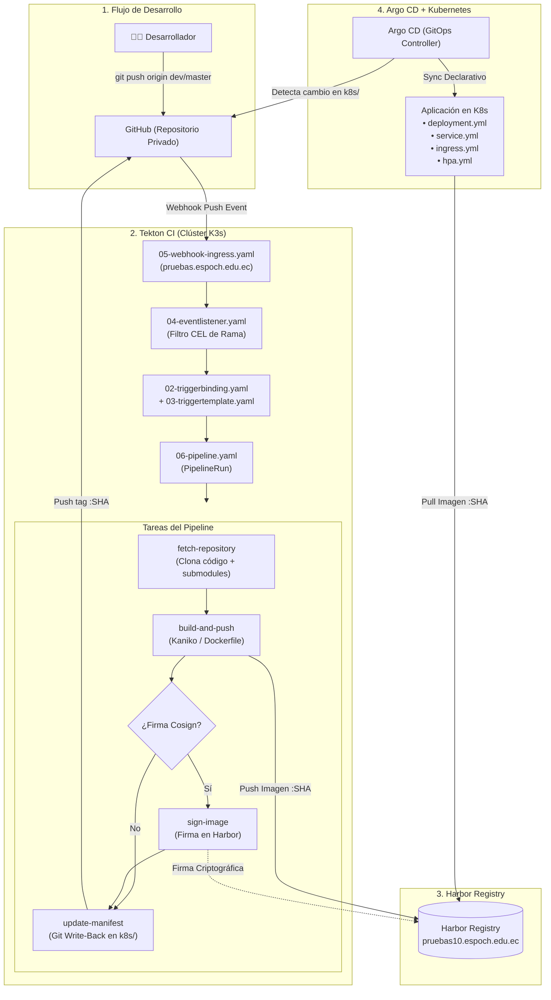

# Generador de Líneas de Fábrica CI/CD (Tekton + Harbor + Argo CD + K8s)

Herramienta de automatización para generar de forma interactiva y estandarizada todos los manifiestos necesarios para integrar nuevos microservicios y aplicaciones al ecosistema **GitOps** de la ESPOCH.

---

## 🏗️ Arquitectura del Pipeline Generado



---

## ⚡ 1. Ejecución Directa desde GitHub (Sin clonar repositorio)

Puedes ejecutar el generador en cualquier máquina utilizando `curl` (Linux/macOS) o `Invoke-RestMethod` (Windows):

### 🪟 En Windows (PowerShell):
```powershell
# Ejecución interactiva directa
irm https://raw.githubusercontent.com/Yariel03/gen-k8s/main/generar_manifiestos_tekton.ps1 | iex
```

### 🐧 En Linux / macOS / Git Bash:
```bash
# Ejecución interactiva directa
bash <(curl -fsSL https://raw.githubusercontent.com/Yariel03/gen-k8s/main/generar_manifiestos_tekton.sh)
```

---

## 🚀 2. Configuración de Alias Globales (`gen-k8s`)

Para poder invocar el generador en cualquier momento desde tu terminal escribiendo simplemente `gen-k8s`:

### 🪟 Configuración en Windows (PowerShell):
1. Abre tu perfil de PowerShell ejecutando:
   ```powershell
   notepad $PROFILE
   ```
2. Agrega la siguiente función al final del archivo y guarda los cambios:
   ```powershell
   function gen-k8s {
       param([string]$Environment, [string]$AppName, [string]$GitRepoUrl, [string]$AppHost, [switch]$Yes)
       irm https://raw.githubusercontent.com/Yariel03/gen-k8s/main/generar_manifiestos_tekton.ps1 | iex
   }
   ```
3. Recarga tu terminal:
   ```powershell
   . $PROFILE
   ```

### 🐧 Configuración en Linux / Git Bash / Zsh:
1. Edita tu archivo `~/.bashrc` o `~/.zshrc`:
   ```bash
   nano ~/.bashrc
   ```
2. Agrega la siguiente línea al final:
   ```bash
   alias gen-k8s='bash <(curl -fsSL https://raw.githubusercontent.com/Yariel03/gen-k8s/main/generar_manifiestos_tekton.sh)'
   ```
3. Recarga tu terminal:
   ```bash
   source ~/.bashrc
   ```

---

## 💻 3. Ejecución Local en el Workspace

Si tienes el repositorio `kube-master` clonado localmente:

### Windows:
```powershell
# Modo interactivo
.\scripts_globales\generador_lineas_fabrica\generar_manifiestos_tekton.ps1

# Modo desatendido / automatizado
.\scripts_globales\generador_lineas_fabrica\generar_manifiestos_tekton.ps1 `
  -Environment prod `
  -AppName sivcc `
  -GitRepoUrl "https://github.com/desarrolloESPOCH/sivcc.git" `
  -AppHost "apisivcc.espoch.edu.ec" `
  -ContainerPort 3000 `
  -SignImage $true `
  -Yes
```

### Linux:
```bash
# Modo interactivo
./scripts_globales/generador_lineas_fabrica/generar_manifiestos_tekton.sh

# Modo desatendido / automatizado
./scripts_globales/generador_lineas_fabrica/generar_manifiestos_tekton.sh \
  -e prod \
  -a sivcc \
  -g "https://github.com/desarrolloESPOCH/sivcc.git" \
  -p "apisivcc.espoch.edu.ec" \
  -c 3000 \
  -s true \
  -y
```

---

## 📋 Parámetros Soportados

| Parámetro (PS) | Flag (Bash) | Descripción | Valor por defecto |
| :--- | :--- | :--- | :--- |
| `-Environment` | `-e` | Entorno de despliegue (`dev` o `prod`) | Preguntado interactivamente |
| `-AppName` | `-a` | Nombre de la App / Microservicio (ej. `sivcc`) | Preguntado interactivamente |
| `-Namespace` | `-n` | Namespace destino en Kubernetes | `<app>-test` (dev) / `<app>-prod` (prod) |
| `-GitRepoUrl` | `-g` | URL del repositorio Git de la aplicación | Obligatorio |
| `-GitBranch` | `-b` | Rama Git que dispara el pipeline | `dev` (dev) / `master` (prod) |
| `-HarborImage` | `-h` | Ruta de la imagen en Harbor Registry | `pruebas10.espoch.edu.ec/<ns>/<app>` |
| `-AppHost` | `-p` | Dominio Ingress para la App (Limpieza FQDN automática) | `api<app>.espoch.edu.ec` (prod) |
| `-ContainerPort`| `-c` | Puerto interno expuesto en el Dockerfile | `3000` |
| `-SignImage` | `-s` | Habilitar tarea de firma Cosign (`$true`/`$false`) | `$true` (Preguntado interactivamente) |
| `-OutputDir` | `-o` | Directorio donde se guardarán los manifiestos | `kubernetes/manifests/<app>/<env>` |
| `-Yes` | `-y` | Modo no interactivo (confirma automáticamente) | `$false` |

---

## 📁 Archivos que Genera

El script genera 2 conjuntos de manifiestos completamente listos:

### 1. Manifiestos de CI/CD para el Clúster (`kubernetes/manifests/<app>/<env>/`):
* `01-rbac.yaml`: ServiceAccount, Role, RoleBinding y **ClusterRoleBinding** para Tekton Triggers y CEL interceptors.
* `02-triggerbinding.yaml`: Captura de variables de GitHub Webhook (commit SHA, repo URL, rama).
* `03-triggertemplate.yaml`: Plantilla de ejecución de PipelineRun con workspace persistente (1Gi) y credenciales.
* `04-eventlistener.yaml`: Receptor del Webhook con filtro CEL de rama y exclusión de commits `[skip ci]`.
* `05-webhook-ingress.yaml`: Ingress NGINX para exponer el endpoint del webhook en `https://pruebas.espoch.edu.ec/listener<app>-<env>`.
* `06-pipeline.yaml`: Definición secuencial del pipeline: `fetch-repository` ➔ `build-and-push` (Kaniko) ➔ `sign-image` (Cosign) ➔ `update-manifest` (Git Write-Back).

### 2. Manifiestos de la Aplicación para Git y Argo CD (`k8s/<env>/`):
* `deployment.yml`: Despliegue con `imagePullSecrets`, límites/solicitudes de CPU y memoria, y montura de `backend-env`.
* `service.yml`: Servicio ClusterIP con mapeo de puerto estándar `80` hacia el puerto interno del contenedor.
* `ingress.yml`: Enrutador Ingress NGINX con el dominio FQDN purgado de la aplicación.
* `hpa.yml`: Autoescalador horizontal de Pods (HPA) con réplicas según entorno (dev: 2-5, prod: 4-8) al 75% de CPU.

---

## 🛠️ Guía Paso a Paso para Desplegar un Nuevo Proyecto

1. **Crear el Namespace en el clúster:**
   ```bash
   kubectl create namespace <app>-test   # Para dev
   kubectl create namespace <app>-prod   # Para prod
   ```

2. **Inyectar los Secretos necesarios en el Namespace:**
   ```bash
   # Credenciales de Harbor para el Pipeline
   kubectl create secret generic harbor-env \
     --namespace=<namespace> \
     --from-literal=HARBOR_USERNAME="usuario" \
     --from-literal=HARBOR_TOKEN="token_harbor"

   # Token de GitHub para Write-Back
   kubectl create secret generic github-credentials \
     --namespace=<namespace> \
     --from-literal=token="ghp_token_github"

   # Clave de firma Cosign (si está habilitada)
   kubectl create secret generic cosign-secret \
     --namespace=<namespace> \
     --from-file=cosign.key=./cosign.key \
     --from-literal=cosign.password="password_cosign"

   # Secret para que los Pods descarguen la imagen privada de Harbor
   kubectl create secret docker-registry harbor-registry-secret \
     --namespace=<namespace> \
     --docker-server=pruebas10.espoch.edu.ec \
     --docker-username="usuario" \
     --docker-password="password"
   ```

3. **Aplicar los manifiestos de Tekton en el Clúster:**
   ```bash
   kubectl apply -f ./kubernetes/manifests/<app>/<env>/
   ```

4. **Copiar la carpeta `k8s/` al repositorio de tu aplicación y hacer commit:**
   ```bash
   cp -r ./kubernetes/manifests/<app>/<env>/k8s /ruta/a/tu/repositorio/
   cd /ruta/a/tu/repositorio/
   git add k8s/
   git commit -m "chore: add k8s deployment manifests"
   git push origin <rama>
   ```

5. **Configurar el Webhook en GitHub:**
   * **Payload URL:** `https://pruebas.espoch.edu.ec/listener<app>-<env>`
   * **Content Type:** `application/json`
   * **Events:** `Just the push event`

6. **Crear la Application en Argo CD:**
   * Apuntando al repositorio de tu App y al path `k8s/<env>`.
